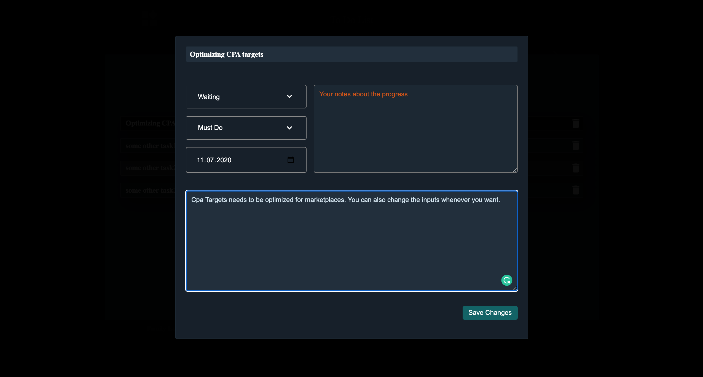

# Modern-Todo-List

This project has been performed with javascript and scss. The aim of the project is just practicing new skills. The project is working through the local storage and there is no backend. 

You can add new families which bundles related todos in it. You may consider the families as epics. 

You can add new todos under related family.

You can change the inputs whenever you want.The changes will be reflected to Local Storage.

You can make both family and todo search.

The project is responsive for different type of devices.

The project also has a menu but it is not working as the project does not have an backend.

